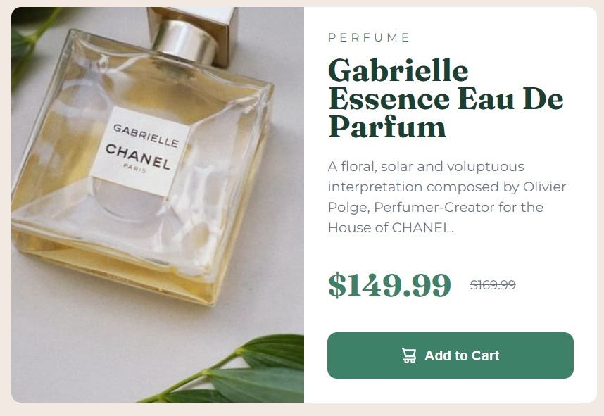

<!-- @format -->

# Frontend Mentor - Product preview card component solution

This is a solution to the [Product preview card component challenge on Frontend Mentor](https://www.frontendmentor.io/challenges/product-preview-card-component-GO7UmttRfa). Frontend Mentor challenges help you improve your coding skills by building realistic projects.

## Table of contents

- [Overview](#overview)
  - [The challenge](#the-challenge)
  - [Screenshot](#screenshot)
  - [Links](#links)
- [My process](#my-process)
  - [Built with](#built-with)
  - [What I learned](#what-i-learned)
- [Author](#author)

## Overview

Create a card for perfume with image, multiple prices, and description info.

### The challenge

Users should be able to:

- View the optimal layout depending on their device's screen size
- See hover and focus states for interactive elements

### Screenshot

### Links

- Solution URL: [Add solution URL here](https://your-solution-url.com)
- Live Site URL: [Add live site URL here](https://your-live-site-url.com)

## My process

- built mobile version first then added media query to change certain elements for desktop

### Built with

- Semantic HTML5 markup
- CSS custom properties
- Flexbox
- CSS Grid
- Mobile-first workflow

### What I learned

- I mainly learned to pay attention to small differences. Not a lot changed between the mobile and desktop versions.
  - `border-radius` changed for the `img` between versions
  - margin on non-image half of the final layout changed on desktop version

## Author

- Website - [salentipy](https://github.com/salentipy)
- Frontend Mentor - [@salentipy](https://www.frontendmentor.io/profile/salentipy)
- Twitter/X - [@salentipy](https://twitter.com/salentipy)
- Threads - [salentipy](https://www.threads.net/@salentipy)
- Mastodon - [salentipy](https://mastodon.social/@salentipy)
